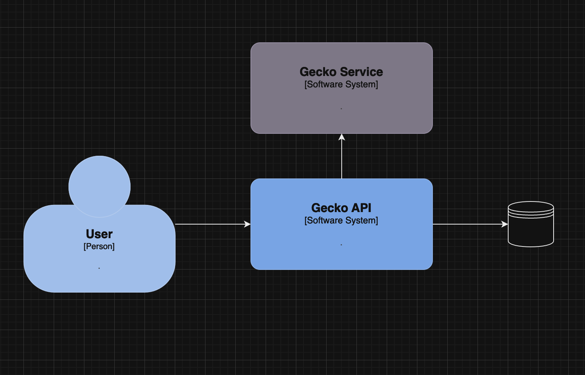
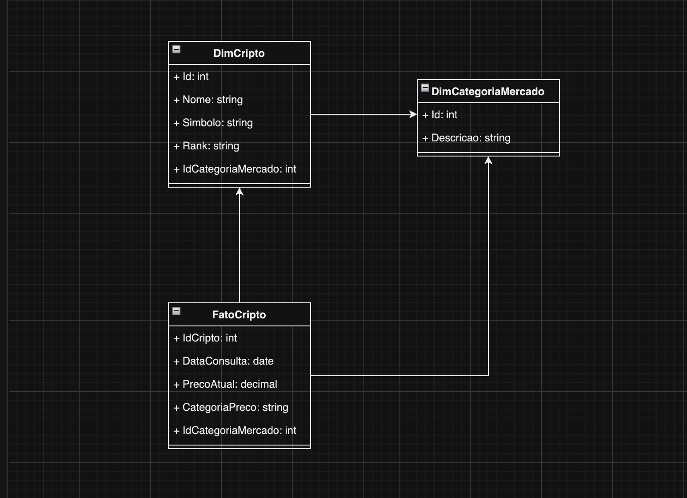

# Gecko API

Este é um projeto FastAPI que se conecta a uma API externa para extrair dados de criptomoedas e armazená-los em um banco de dados MySQL. A API fornece endpoints para extrair e consultar dados sobre criptomoedas.

### Diagrama de representação arquitetural


### Diagrama de entidade e relacionais


## Estrutura do Projeto
- main.py/: Arquivo de inicialização da aplicação FastAPI.
- models/: Contém as definições dos modelos de dados e mapeamentos SQLAlchemy.
- services/: Serviços de manipulação de dados e acesso a base.
- requirements.txt: Arquivo de dependências utilizadas no projeto
- docker-compose.yml: Arquivo para inicialização do banco de dados via container (**Opcional**)

## Configuração do Ambiente
### Pré-requisitos
- Python3.12+
- MySQL
- Docker (Opcional)

Como executar o projeto
```bash
    git clone https://github.com/jlfjunior/gecko.git
    cd gecko
```

Crie e Ative um Ambiente Virtual

```bash
python -m venv .venv # Ou python3 -m venv .venv
source .venv/bin/activate  # No Windows: .venv\Scripts\activate
``` 
Instale as Dependências

```bash
pip install -r requirements.txt
```
Configure o Banco de Dados
Certifique-se que ajustou as variaveis no arquivo `database.py`.

Execute a Aplicação
```bash
python3 main.py
```

## Documentação dos Endpoints

Você pode acessar os seguintes endpoints para interagir com a API:

- GET /status: Verifica se o serviço está disponível.
- POST /extract: Extrai dados de criptomoedas e os armazena em banco de dados.
- GET /criptos: Consulta cadastro das criptomoedas.
- GET /criptos/prices: Consulta os preços historicos de criptomoedas armazenados em banco de dados.